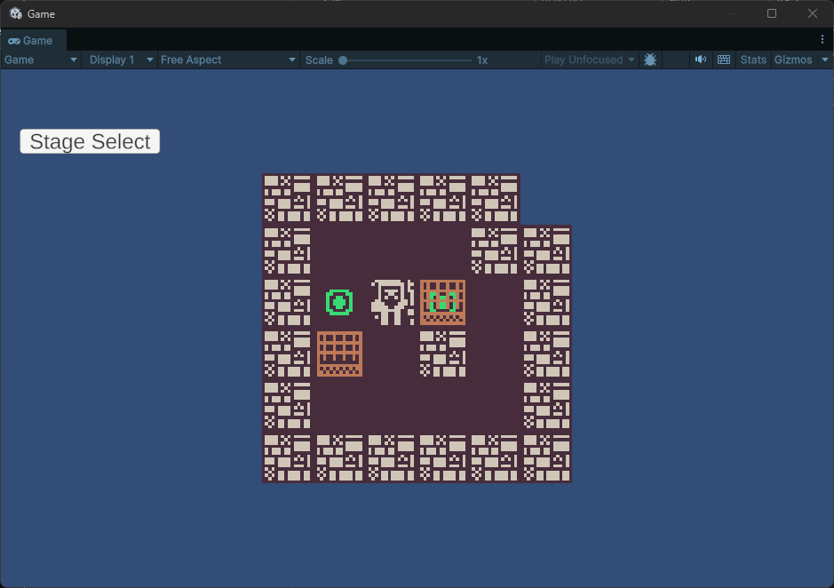
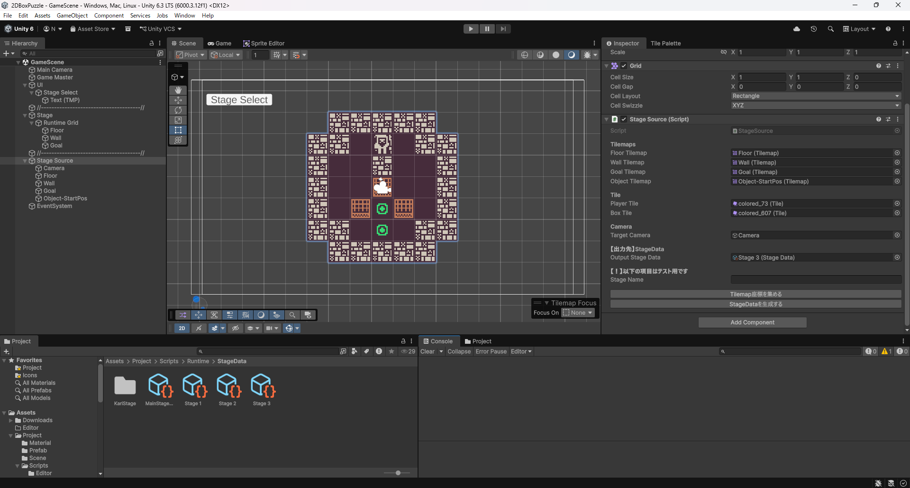
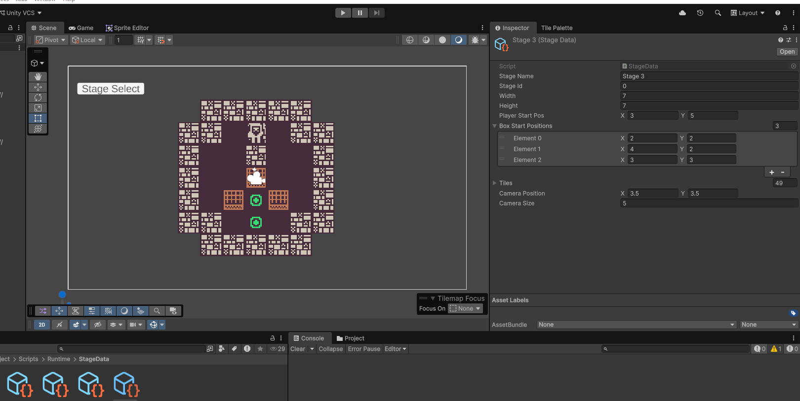
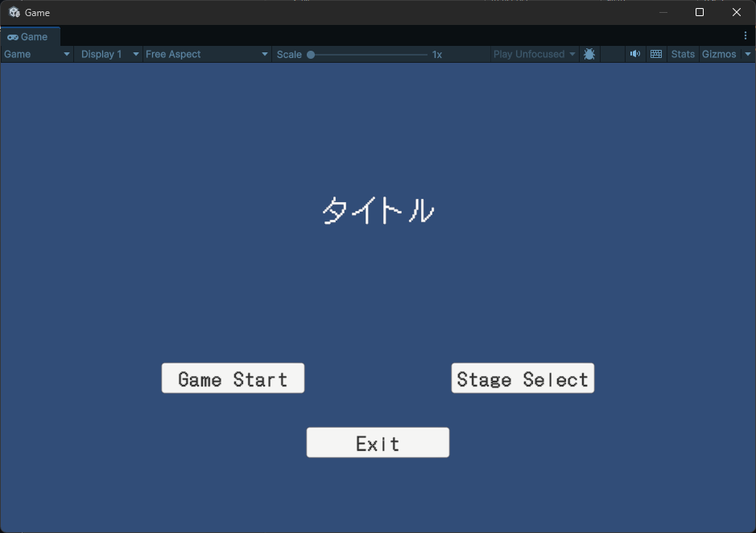
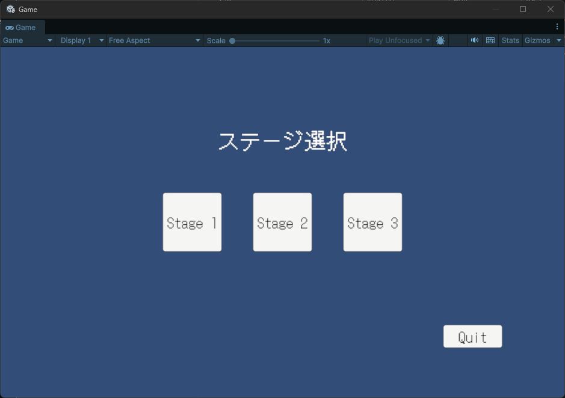

# 2D Sokoban

Unity / C# で制作した2D倉庫番パズルゲームです。

---

## 使用技術

- Unity 2022.3.22f1
- C#
- UnityEngine.Tilemaps
- ScriptableObject
- Unity Editor 拡張（CustomEditor）

---

## 実装のポイント

### カスタムエディタによるステージ管理

ステージデータの作成・更新を効率化するため、Unity Editor 拡張（`CustomEditor`）を自作しました。

Tilemap 上にステージを配置した状態で「StageDataを生成する」ボタンを押すと、タイル座標・プレイヤー初期位置・箱の初期位置・カメラ設定を自動で収集し、ScriptableObject（`StageData`）に書き出します。

手動でデータを入力する手間をなくし、ステージ編集のたびにワンクリックで反映できる仕組みにしています。

---

### ScriptableObject によるデータ管理

ステージデータを `StageData`（ScriptableObject）として管理し、ステージの追加・削除をコードの変更なしに行えます。

---

### シーン間のデータ受け渡し

`static` クラス（`StageSession`）を使い、ステージ選択画面で選んだ `StageData` をゲームシーンへ受け渡しています。`DontDestroyOnLoad` を使わずシンプルに実装しました。

---

### Undo / リセット機能

プレイヤーの移動・箱の移動をひとつの操作単位として `Stack<GameState>` に積んでいます。Undo キー（Z）で1手ずつ戻せるほか、リセットキー（R）でステージ開始時の状態に一括復元できます。

---

## 操作方法

| キー | 動作 |
|---|---|
| W / A / S / D | 移動 |
| Z | 1手戻す（Undo） |
| R | リセット |

---

## 画面

### タイトル

### ステージ選択

---

## 使用アセット

| アセット名 | 用途 |
|---|---|
| [Kenney 1-Bit Pack](https://kenney.nl/assets/1-bit-pack) | タイル・キャラクター画像 |
| [DotGothic16](https://fonts.google.com/specimen/DotGothic16) | フォント |

---

## 開発プロセスについて

設計の壁打ちや実装方針の確認に ChatGPT（OpenAI）および Claude（Anthropic）を活用しました。
提案された内容を自分で理解・判断した上で実装しています。

また、学習過程で詰まった点や得た知識を Notion にログとして記録しながら進めました。

---

## 制作期間

2026年4月 ~ 5月
